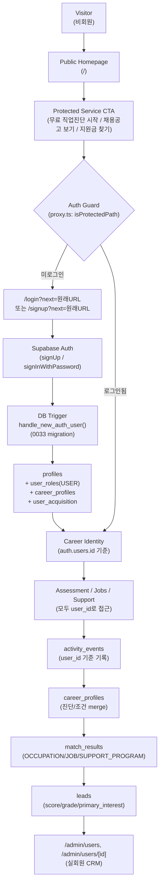
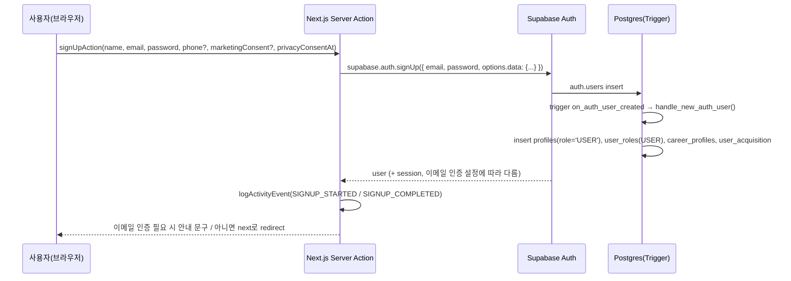
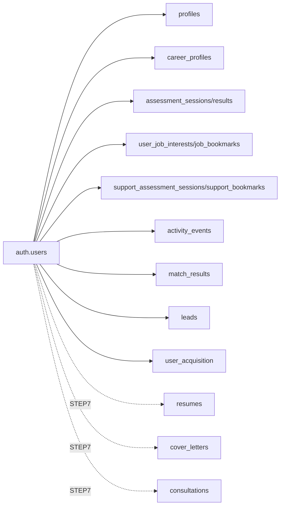

# Auth & Career Identity (STEP 6)

STEP 6에서 "한평생 바로취업"은 **Member-first** 서비스가 되었다. 핵심 서비스(직업진단/채용공고/지원금찾기/마이페이지)는
회원가입 또는 로그인 이후에만 사용할 수 있고, 로그인한 회원의 모든 행동은 처음부터 `auth.users.id` 기준으로 저장된다.

## 1. Member-first Flow

## 2. 회원가입 → Career Identity 생성 시퀀스

핵심: 클라이언트는 `role`을 지정할 수 없다. `handle_new_auth_user()`가 항상 `role='USER'`로 고정해서 생성한다
(`supabase/migrations/0033_step6_auth_identity_trigger.sql`). Profile 생성이 Server Action의 별도 INSERT에
의존하지 않으므로, 회원가입 API 호출이 중간에 끊겨도 "auth.users만 있고 profiles가 없는" half-created 상태가
발생하지 않는다(DB Trigger는 `auth.users` insert와 같은 트랜잭션에서 실행됨).

## 3. Route 권한표

| Route | 분류 | 비회원 | 로그인 회원(USER) | ADMIN/SUPER_ADMIN | 처리 위치 |
| --- | --- | --- | --- | --- | --- |
| `/`, 회사소개, 이용약관 등 일반 콘텐츠 | Public | 허용 | 허용 | 허용 | - |
| `/login`, `/signup`, `/forgot-password`, `/reset-password` | Auth | 허용 | `next` 또는 `/mypage`로 redirect | 동일 | `src/proxy.ts` (`isAuthPath`) |
| `/auth/confirm` | Auth 콜백 | 허용 (토큰으로 검증) | 허용 | 허용 | `src/app/auth/confirm/route.ts` |
| `/assessment/**` | Protected | `/login?next=/assessment...`로 redirect | 허용 | 허용 | `src/proxy.ts` (`isProtectedPath`) |
| `/jobs/**` | Protected | 동일 | 허용 | 허용 | 동일 |
| `/support/**` | Protected | 동일 | 허용 | 허용 | 동일 |
| `/mypage/**` | Protected | 동일 | 허용 (본인 데이터만) | 허용 | 동일 |
| `/admin/**` | Admin | `/login?next=/admin...`로 redirect | **차단** (권한 없음 화면, redirect 아님) | 허용 | `src/proxy.ts`(로그인 여부) + `requireAdmin()`(`src/lib/auth/session.ts`, 실제 DB role 조회) |

(향후 `/resume/**`, `/cover-letter/**`, `/consulting/**`도 Protected로 추가될 예정 — STEP 7.)

**2단 방어(Defense in depth)**:
1. `src/proxy.ts` (Next.js Proxy/구 middleware) — 세션 쿠키 존재 여부만으로 1차 optimistic 차단. `/admin/**`은
   로그인 여부까지만 여기서 걸러내고, 실제 role 조회는 하지 않는다(Next.js 공식 가이드: Proxy에서 DB 조회 금지).
2. 각 Server Component (`requireUser()` / `requireAdmin()` / `requireStaff()`, `src/lib/auth/session.ts`) —
   실제 DB에서 `profiles.role`을 조회해 최종 인가 결정을 내린다. **Client에서 메뉴만 숨기는 방식은 보안 경계로 쓰지 않는다.**
3. Supabase RLS — 위 두 단계를 모두 우회해도 DB 레벨에서 `auth.uid() = user_id` 정책이 최종 방어선이 된다
   (`supabase/migrations/0013_rls.sql`, `0019_step3_5_rls_fixes.sql`, `0022_step3_5_anon_rls_readback_fix.sql`).

## 4. next 파라미터 보안

`src/lib/auth/redirect.ts`의 `sanitizeNextPath()`가 모든 `next` 값을 검증한다.

- `/`로 시작하지 않는 값(예: `https://evil.example`) → 기본값(`/mypage`)으로 대체.
- `//evil.example`, `/\evil.example` 같은 프로토콜 상대 URL → 차단.
- 개행/제어문자(헤더 인젝션 방지), 허용되지 않은 문자 → 차단.

`buildLoginRedirectUrl(pathname, search, base)`가 `/login?next=...`를 만들 때 항상 원래 pathname+search를
`encodeURIComponent`로 인코딩해서 넣으므로, 로그인/회원가입 완료 후 원래 요청한 화면으로 정확히 복귀한다.

## 5. Supabase Auth 클라이언트 구조

| 파일 | 용도 | 키 |
| --- | --- | --- |
| `src/lib/supabase/browser.ts` | Client Component에서 사용 (폼 제출 등) | anon key |
| `src/lib/supabase/server.ts` | Server Component/Server Action/Route Handler (`cookies()` 기반 세션) | anon key + 세션 쿠키 |
| `src/lib/supabase/admin.ts` | 관리자/서버 전용 배치 작업(회원 목록 집계, 트리거 검증 등) | `service_role` (RLS bypass) |

`SUPABASE_SERVICE_ROLE_KEY`는 절대 일반 사용자 Auth 경로(로그인/회원가입/세션 확인)에 사용하지 않는다.
일반 사용자 데이터 접근은 항상 anon key + 로그인 세션(JWT)으로 RLS를 통과해야 한다.

## 6. Career Identity 확장 (STEP 7 대비)

모든 하위 테이블은 `user_id uuid references profiles(id)` (또는 `auth.users(id)`) 형태의 FK로 연결되어 있어,
STEP 7에서 이력서/자기소개서 테이블이 추가되어도 동일한 패턴(`user_id` FK + RLS `auth.uid() = user_id`)을
그대로 재사용할 수 있다.

## 7. 이메일 인증 / 비밀번호 재설정

- Supabase Dashboard → Authentication → URL Configuration에서 **Site URL**과 **Redirect URLs**에
  `{배포 도메인}/auth/confirm`을 등록해야 한다 (로컬 개발: `http://localhost:3000/auth/confirm`).
- Email Templates → "Confirm signup" / "Reset Password" 링크를 다음 형태로 설정한다:
  `{{ .SiteURL }}/auth/confirm?token_hash={{ .TokenHash }}&type={{ .Type }}&next=/mypage`
- `type=signup|email`이면 인증 완료 후 세션을 만들고 `next`로 이동한다.
- `type=recovery`(비밀번호 재설정)면 세션을 만들고 `/reset-password`로 보내 새 비밀번호를 입력하게 한다.
- 개발환경에서 Supabase 프로젝트의 "Confirm email"이 꺼져 있으면 `signUp()`이 즉시 세션을 반환하므로,
  회원가입 후 별도 이메일 인증 없이도 Flow가 깨지지 않는다 (`src/features/auth/auth-actions.ts`가 두 경우를 모두 처리).

## 8. 계정 삭제(탈퇴) 정책 — 결정 필요 항목

이번 STEP에서는 탈퇴 기능 자체를 구현하지 않았다. 향후 구현 시 다음을 정책적으로 결정해야 한다
(법률적 결론을 임의로 내리지 않고 문서화만 해둔다):

- 탈퇴 시 Career 데이터(`assessment_results`, `activity_events`, `match_results` 등)를 **hard delete**할지,
  **anonymize**(user_id만 NULL 처리하고 통계 목적으로 유지)할지, 일정 기간 **retention** 후 삭제할지.
- `auth.users` 삭제 시 `profiles.id references auth.users(id) on delete cascade`이므로, 단순히
  `admin.auth.admin.deleteUser(id)`만 호출해도 `profiles` 이하 대부분의 사용자 데이터가 cascade로 삭제된다
  (스키마 확인: `0001_profiles.sql`, `0002_career_profiles.sql` 등). 즉시 삭제가 필요하면 이 경로를 사용할 수 있으나,
  "탈퇴 후에도 통계/감사 목적으로 일부 데이터를 남겨야 하는가"는 별도 정책 결정이 필요하다.
- `consultations`(상담 이력)처럼 상담사/운영 관점에서 계속 필요한 데이터가 있다면, 탈퇴와 무관하게 별도 보존 정책이 필요할 수 있다.

## 9. 테스트/Seed 계정

- `supabase/migrations/0015_seed.sql`이 만든 `seed01@baro.local` ~ `seed20@baro.local` (비밀번호 `password123`) 20건은
  관리자 화면 데모용 Career DB Seed다. `/admin/users`에서 "테스트" 배지로 구분 표시된다(`email`이 `@baro.local`로 끝나는 계정).
- 각 `smoke:*`/`e2e:*` 스크립트도 실행마다 `*@baro.local` 임시 계정을 만들고 종료 시 스스로 정리한다.
- 운영 배포 전 정리 방법: `npm run cleanup:seed-accounts` (기본 dry-run, `--delete` 플래그로 실제 삭제). 기존 migration은
  수정하지 않고, 이 스크립트도 명시적으로 `--delete`를 주지 않으면 아무 것도 삭제하지 않는다.
