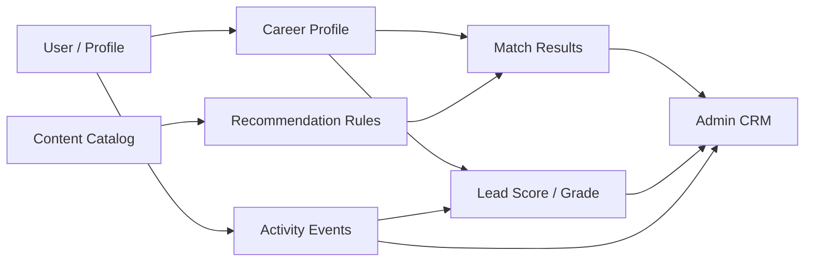
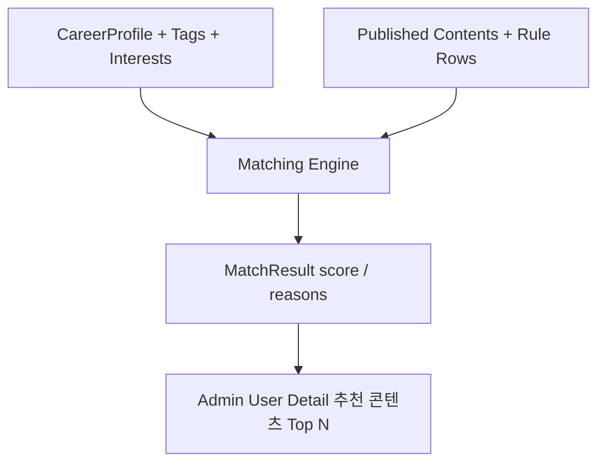
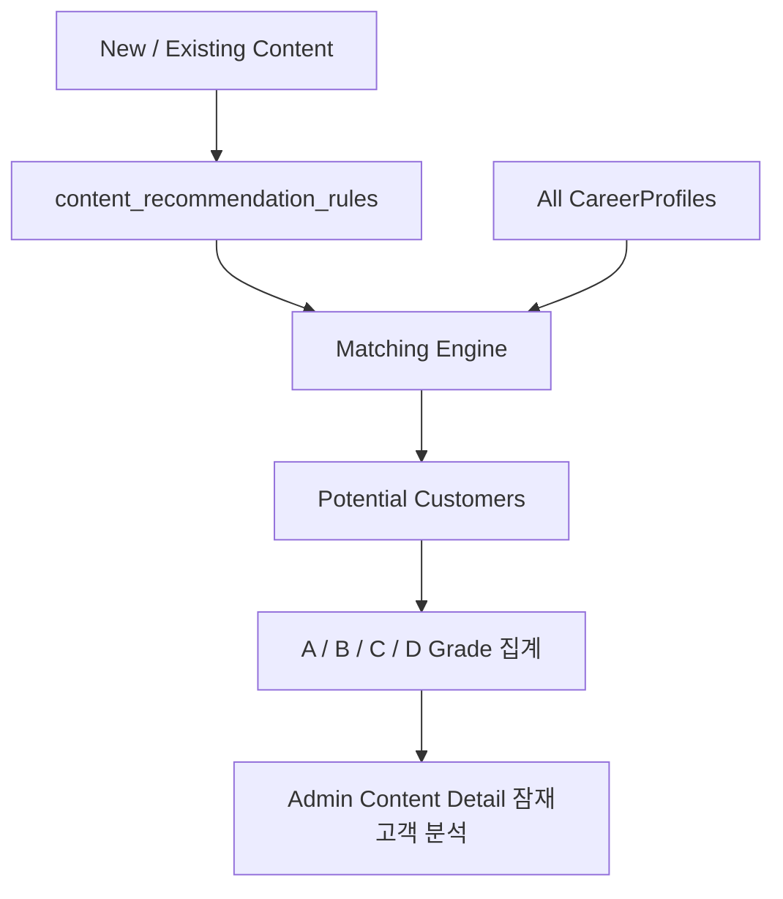
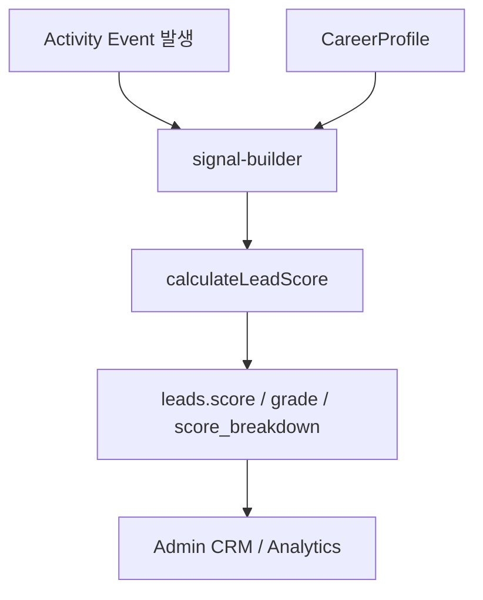

# Database Architecture — 한평생 바로취업

STEP 2에서 정의한 Career DB / Matching / Lead 영속화 구조입니다.

## 핵심 데이터 흐름

## USER → CONTENT Matching

## CONTENT → USERS Matching

## Activity → Lead Score

## 주요 테이블 그룹

| 그룹 | 테이블 |
| --- | --- |
| Identity | `profiles`, `user_roles`, `user_acquisition` |
| Career DB | `career_profiles`, `tags`, `user_tags`, `qualifications`, `user_qualifications`, `user_qualification_interests`, `occupations`, `user_job_interests` |
| Catalog | `contents`, `content_tags`, `content_recommendation_rules`, `jobs`, `support_programs` |
| Behavior | `activity_events`, `anonymous_identity_links` |
| Assessment | `assessments`, `assessment_questions`, `assessment_options`, `assessment_sessions`, `assessment_answers`, `assessment_results` |
| CRM | `leads`, `consultations`, `consultation_notes`, `match_results`, `resumes` |

## RLS 원칙

- 일반 사용자: 본인 `profiles` / `career_profiles` / `resumes` / `assessment_results` / `consultations` 조회·제한적 수정
- Staff (`CONSULTANT`, `ADMIN`, `SUPER_ADMIN`): CRM 조회
- Admin: Catalog CRUD, Lead 쓰기, Rule 관리
- `is_admin()` / `is_staff()` security definer 함수로 역할 판별 (Client `isAdmin` 플래그 금지)

## Mock Mode vs Supabase Mode

| 모드 | 조건 | 동작 |
| --- | --- | --- |
| Mock | env 없음 또는 `DATA_SOURCE=mock` | InMemory Repository + Seed Mock |
| Supabase | URL+KEY 설정 또는 `DATA_SOURCE=supabase` | Supabase Repository (없으면 Mock 폴백) |

UI → Service → Repository → (Mock | Supabase)
